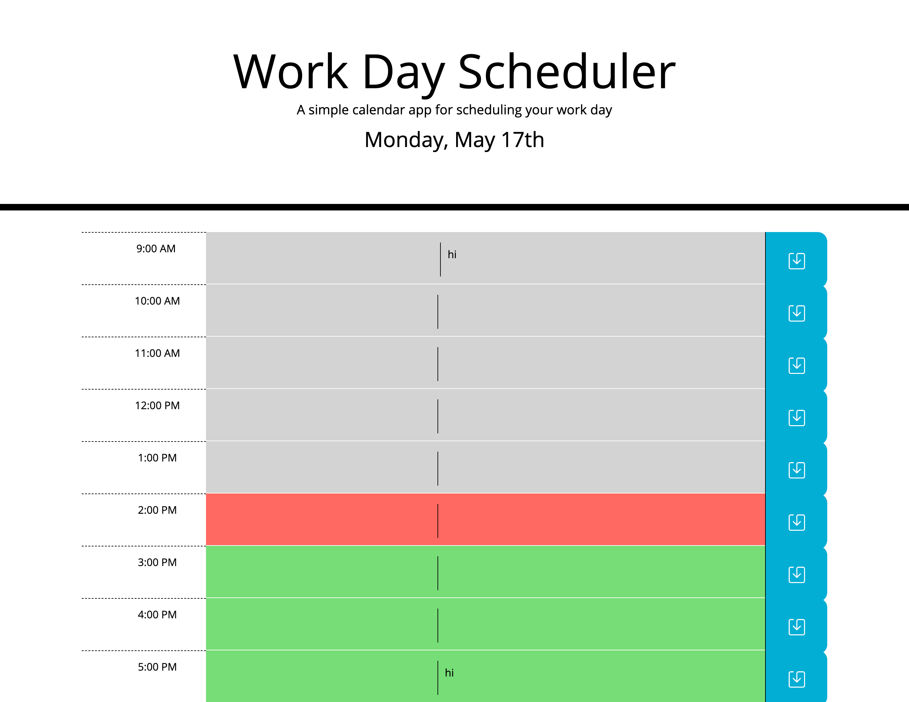

# Workday Task Management

## Purpose and features

- This website allows users to manage their tasks in their 9-5 work day.
- Users are able to easily add and edit tasks to their local storage with the save button
- Users can be aware of due dates of tasks through the css classes highlighting past, present, and future tasks.

## Built With

- HTML
- CSS
- JS

## Website

- Access the task management here:
  https://ericababb.github.io/work-day-task/

